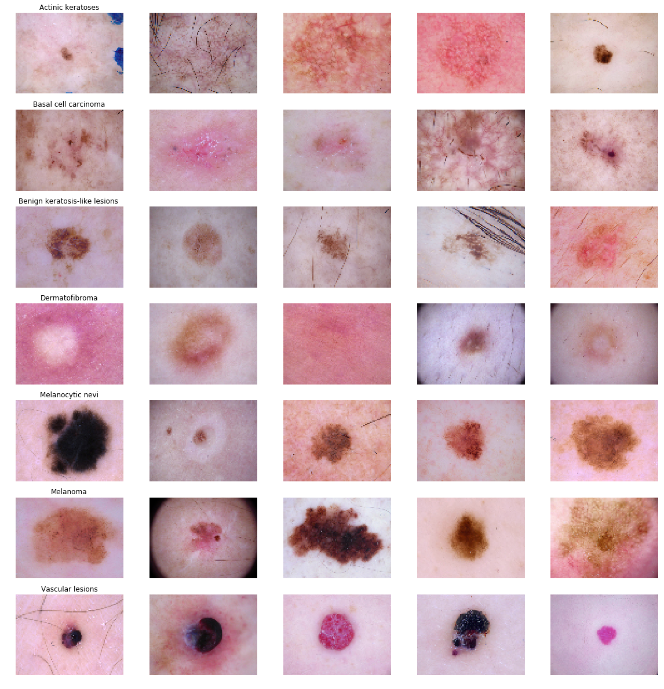
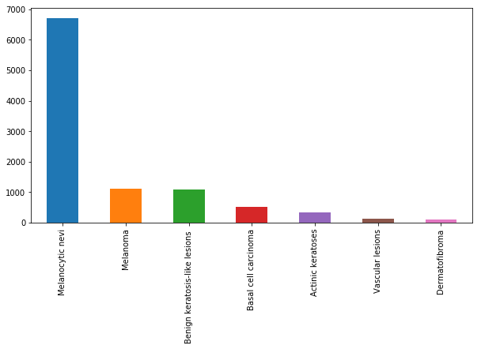
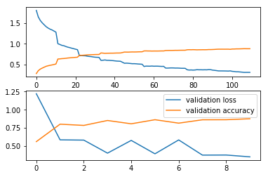
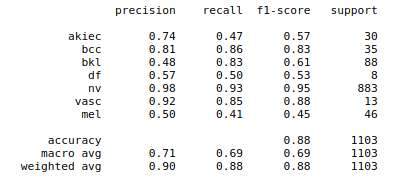
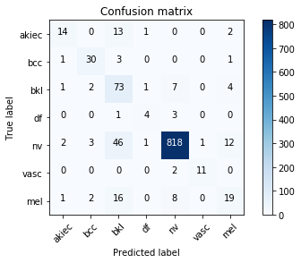
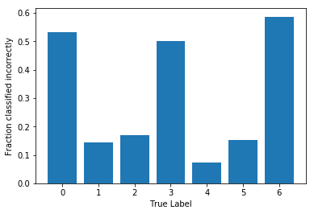

# Skin Cancer Prediction

The goal is design an image processing algorithm that can determine the type of the cancer that is displayed in an image. The code is based on PyTorch.

# Overview

[HAM10000 ("Human Against Machine with 10000 training images")](https://arxiv.org/abs/1803.10417) dataset consists of dermatoscopic images from different populations, acquired and stored by different modalities. The final dataset consists of 10015 dermatoscopic images which can serve as a training set for academic machine learning purposes. Cases include a representative collection of all important diagnostic categories in the realm of pigmented lesions: Actinic keratoses and intraepithelial carcinoma / Bowen's disease (akiec), basal cell carcinoma (bcc), benign keratosis-like lesions (solar lentigines / seborrheic keratoses and lichen-planus like keratoses, bkl), dermatofibroma (df), melanoma (mel), melanocytic nevi (nv) and vascular lesions (angiomas, angiokeratomas, pyogenic granulomas and hemorrhage, vasc).

More than 50% of lesions are confirmed through histopathology (histo), the ground truth for the rest of the cases is either follow-up examination (follow_up), expert consensus (consensus), or confirmation by in-vivo confocal microscopy (confocal). The dataset includes lesions with multiple images, which can be tracked by the lesion_id-column within the HAM10000_metadata file.

I have used `resnext101_32x8d` with pretrained weights for training and classification.

## Contents
  - [1. Setup Instructions and Dependencies](#1-Setup-Instructions-and-Dependencies)
  - [2. Dataset](#2-Dataset)
  - [3. Training the model](#3-Training-the-model)
  - [4. Observations](#4-Observations)
  - [5. Repository overview](#5-Repository-overview)


## 1. Setup Instructions and Dependencies

Clone the repositiory on your local machine.

``` Batchfile
git clone https://github.com/ishanrai05/skin-cancer-prediction
```

Start a virtual environment using python3
``` Batchfile
virtualenv env
```


Install the dependencies
``` Batchfile
pip install -r requirements.txt
```

You can also use google collab notebook. In that case just upload the notebook provided in the repository and you are good to go.

## 2. Dataset

The dataset is available to download from the official site [here](https://doi.org/10.7910/DVN/DBW86T). Download and extract the dataset in `input` folder in the same directory.

#### Sample



#### Data Distribution




## 3. Training the model

To train the model, run

```Batchfile
python main.py --train=True
```

optional arguments:
  | argument | default | desciption|
  | --- | --- | --- |
  | -h, --help | | show help message and exit |
  | --use_cuda | False | device to train on. default is CPU |
  | --samples | False | See sample images |
  | --view_data_counts | False | Visualize data distribution |
  | --num_epochs | 10 | Number of epochs to train on |
  | --train | True | train the model |

## 4. Observations

I achieved a training accuracy as high as 88.149% and validation accuracy as high as 87.565%.

The top graph indicates training loss(blue line) and training accuracy(orange line)

### Accuracy and Loss




### Classification Report




### Confusion Matrix




### Fractions Classified Incorrectly




## 5. Repository overview

This repository contains the following files and folders

1. **notebook**: This folder contains the jupyter notebook for code.

2. **resources**: Contains images.

3. `dataset_loader.py`: pytorch code to load the dataset.

4. `models.py`: code for models.

5. `read_data.py`: code to read images.

6. `visualize.py`: code for visualizations.

7. `utils.py`: Contains helper functions.

8. `train.py`: function to train models from scratch.

9. `main.py`: contains main code to run the model.

10. `requirements.txt`: Lists dependencies for easy setup in virtual environments.


## Citations

```
@data{DVN/DBW86T_2018,
author = {Tschandl, Philipp},
publisher = {Harvard Dataverse},
title = "{The HAM10000 dataset, a large collection of multi-source dermatoscopic images of common pigmented skin lesions}",
UNF = {UNF:6:IQTf5Cb+3EzwZ95U5r0hnQ==},
year = {2018},
version = {V1},
doi = {10.7910/DVN/DBW86T},
url = {https://doi.org/10.7910/DVN/DBW86T}
}
```